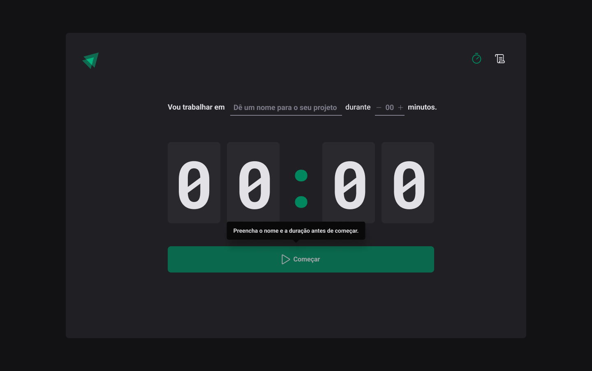

# Ignite Timer

## Description
<h1 align="center">
    <a href="https://pt-br.reactjs.org/">🔗 React</a>
</h1>

🚀 Project using the React.js module, using React's Context api and the Single Page Application (SPA) concept from Rocketseat's Ignite track.

<h1 align="center">
  
</h1>

### 🛠 Technologies

The following tools were used to build the project:

- [React](https://react.dev/)
- [Date-fns](https://date-fns.org/)
- [Phosphor-react](https://phosphoricons.com/)
- [Eslint](https://eslint.org/)
- [TypeScript](https://www.typescriptlang.org/)
